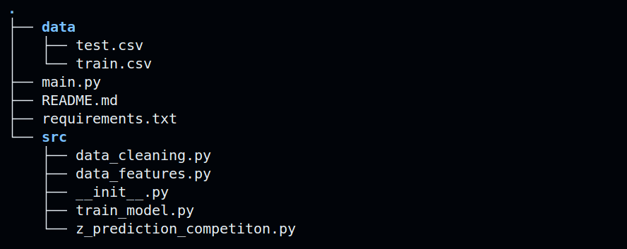

# README — Data Science BE (Projet)

## Contexte & problématique
C'est dans le cadre du BE du MOD *Data Science* que s'inscrit ce projet.
Le contexte, les enjeux, la problématique et la démarche sont expliqué dans le rapport foruni.

## Prérequis
- Python 3.8+ installé sur la machine.
- accès terminal (Linux/macOS) ou PowerShell (Windows).
- [optionnel] Git si clonage depuis un dépôt distant.

## Structure du projet.



## Installation & préparation de l'environnement virtuel (Linux/macOS)
1. Se placer dans la racine du projet  avec la commande : 
   ```
   cd
   ```

2. Créer l'environnement virtuel :
   python3 -m venv .venv

3. Activer l'environnement :
   source .venv/bin/activate

4. Mettre pip à jour :
   pip install --upgrade pip

5. Installer les dépendances :
   - Si un fichier requirements.txt existe :
     pip install -r requirements.txt
   - Sinon, installer manuellement les paquets nécessaires (ex. pandas, scikit-learn, matplotlib) :
     pip install pandas scikit-learn matplotlib seaborn

## Activation & désactivation (Windows PowerShell)
- Création :
  python -m venv .venv
- Activation :
  .\.venv\Scripts\Activate.ps1
- Désactivation :
  deactivate

## Structure recommandée du projet
- data/            — jeux de données (ne pas versionner les gros fichiers)
- src/             — code source (modules, utilitaires)
- notebooks/       — notebooks d'exploration
- models/          — modèles entraînés / checkpoints
- requirements.txt — dépendances
- main.py          — point d'entrée du pipeline

Adapter ces chemins si le projet diffère.

## Exécution du fichier main
1. S'assurer que l'environnement virtuel est activé.
2. Lancer le pipeline depuis la racine du projet :
   python main.py
3. Options courantes (exemples) :
   python main.py --config config.yml
   python main.py --mode train
Vérifier que main.py expose les options souhaitées (help) :
   python main.py --help

## Bonnes pratiques
- Versionner requirements.txt (pip freeze > requirements.txt) après installation.
- Utiliser .gitignore pour exclure .venv, data/ volumineux et models/.
- Documenter les paramètres de configuration (config.yml ou README section "Configuration").

## Dépannage
- Erreur de version Python : vérifier python --version.
- Module introuvable : vérifier pip install -r requirements.txt et que l'environnement est activé.
- Permission denied : vérifier droits d'exécution et chemin d'accès.

Modifier ce README pour inclure la description précise du jeu de données, les métriques de succès et les dépendances exactes du projet.